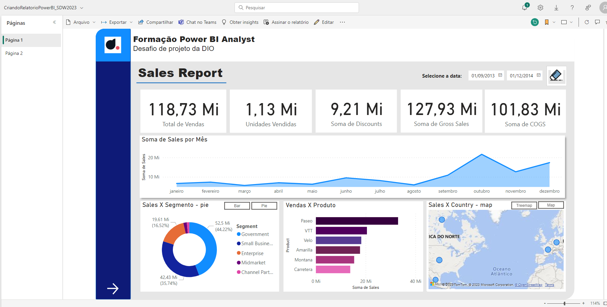
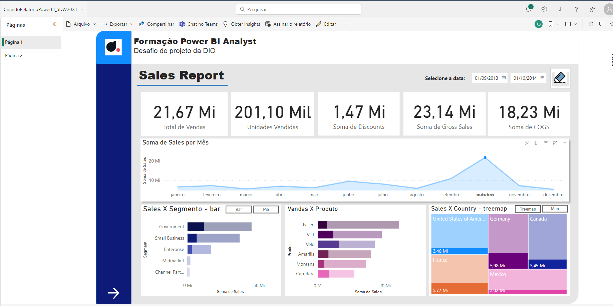
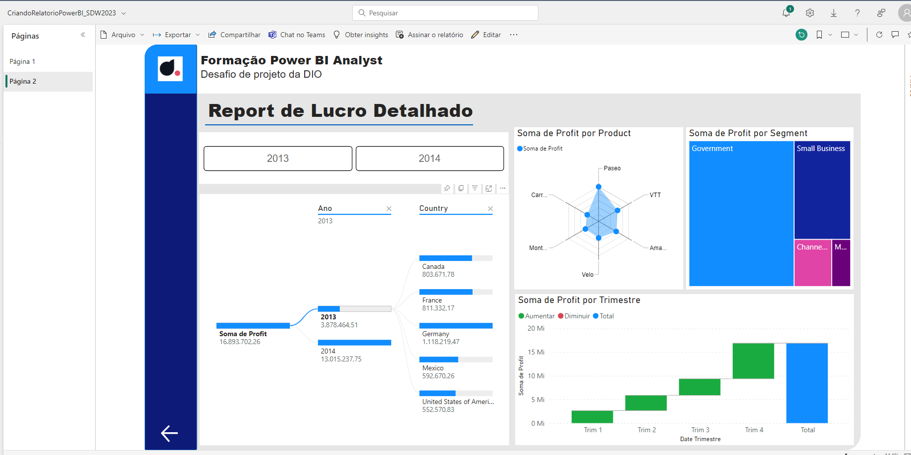
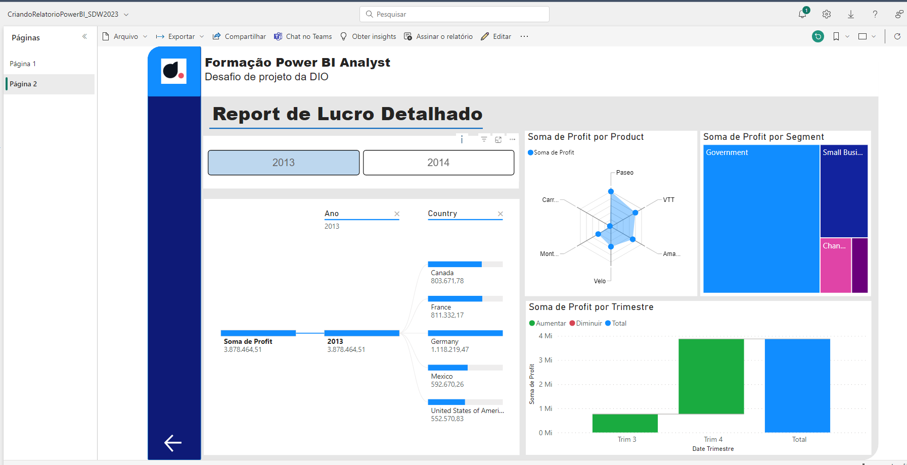

# Desafio - Criando um Relatório de Vendas Elegante com Power BI
Desafio proposto no Bootcamp Santander Dev Week 2023 - Ciência de Dados realizado pela DIO.ME

## Proposta
Criar um relatório de vendas baseado nos dados disponibilizados através do arquivo "Financial Sample.xlsx", mantendo a relação entre os gráficos e operabilidade por botões.

## Realização
O relatório foi construido no Power BI Desktop permitindo alternar alguns tipos de gráficos através de botões, modificar o período analisado, navegar entre as páginas e interação entre os componentes que integram o relatório.

Após publicado no Power BI Server utilizando uma conta de estudante ele manteve suas caracteristicas apresentando a seguinte interface:

### Página 1 - padrão

### Página 1 - dados filtrados

### Página 2 - padrão

### Página 2 - dados filtrados
