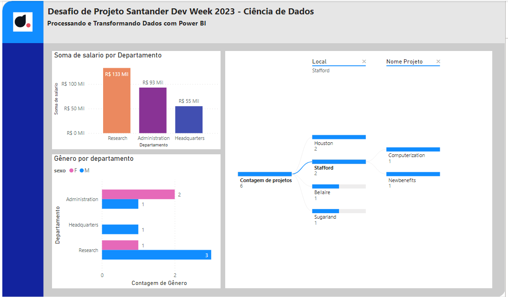

# Desafio - Processando e Transformando Dados com Power BI
Desafio proposto no Bootcamp Santander Dev Week 2023 - Ciência de Dados realizado pela DIO.ME para fixar os conhecimento em transformação e tratamento de dados utilizando Power BI e Power Query.

## Proposta
Carregar uma base de dados MySQL na plataforma Azure, contendo dados fictícios sobre o funcionário, departamento e projetos de uma empresa. Realizar análise e tratamento dos dados através através do Power BI e Power Query.

## Realização
Criada uma instância MySQL na plataforma Azure, executando os scripts de criação, alteração e carga das tabelas, disponibilizados para o desafio, realizando algumas correções.

Após estabelecida a conexão do Power BI com a instância do banco MySQL no Azure e importada as estruturas, as colunas foram renomeadas e os dados tratados e transformados.
Nas transformações pude aplicar a mescla de consultas, onde é possível criar uma nova consulta similar a uma view com as novas combinações de daos desejada. E também aplicar o "acrescentar colunas" que insere os dados de uma tabela na outra, criando uma espécie de "tabelão".

O relatório por mim criado apresenta a seguinte interface e análise:

